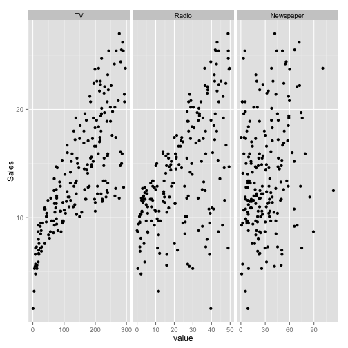
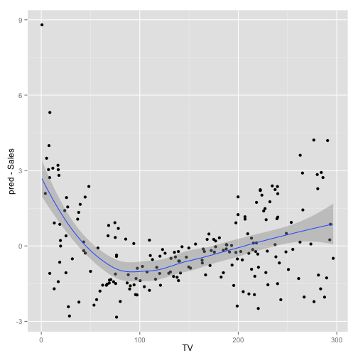
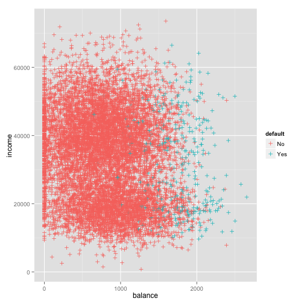
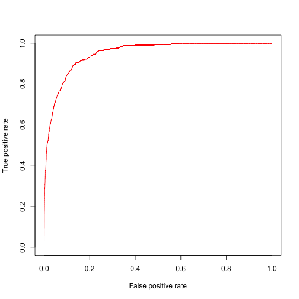

Statistical Learning with R
========================================================
author: Guy Freeman <guy@dataguru.hk>
date: Monday 16th June 2014

Statistical learning with R
========================================================
width: 1920
height: 1080


- Why learning?
- Why statistical learning?
- Why R?
- Why me?
 - I use R to carry out statistical learning every (week)day for DemystData.

R, the statistical programming language
========================================================

I know that Mart has been using Python with you, which is all well and good.

I've been using R for 15 years now, and I want to show you the advantages (and maybe a few disadvantages) of using a programming language designed purely for statistical analysis. Then you can decide which tool to use for different occasions.

The New York Times approves of R! http://www.nytimes.com/2009/01/07/technology/business-computing/07program.html?pagewanted=all

Statistical learning -- it's like machine learning, but better
========================================================

These are my subjective definitions:

*Machine learning* is running algorithms to understand patterns in data and make predictions from inputs.

_Statistical learning_ is machine learning where you understand why the algorithms work and when they work.

Introduction to R
===

"R is a language and environment for statistical computing and graphics" -- the official description of R at its homepage r-project.org

It also happens to be Free Software (just like Python). You can use it without paying money, and you can copy it and modify it and distribute it.

You can download it from http://cran.r-project.org/

You can optionally install RStudio, and Integrated Development Environment for R, from http://www.rstudio.com/products/rstudio/download/

Functions in R
===

R uses *functions* to carry out procedures on (optional) inputs (aka *arguments*).

For example, the `sum` function calculates the sum of its inputs (so original!).


```r
sum(3,5,500,pi)
```

```
[1] 511.1
```


Vectors in R
===

To create a vector of numbers we use the `c` function [short for "concatenate"]. We can save this vector to a variable using `<-`.


```r
x <- c(1,8,7,15)
x
```

```
[1]  1  8  7 15
```


Many functions in R are "vectorized", which means they know what to do with vectors. Adding two vectors, for example, works how you'd expect:


```r
y <- c(20,8,4,1)
y + x
```

```
[1] 21 16 11 16
```


Objects in R
===

What objects have we created so far? Use `ls()` to find out:


```r
ls()
```

```
[1] "x" "y"
```


Delete anything you don't want any more with `rm()`:


```r
rm(y)
ls()
```

```
[1] "x"
```


Matrices in R (with some help)
===

The `matrix` function in R creates matrices. How? Let's use R's help system.


```r
?matrix
matrix(data=c(1,2,3,4), nrow=2, ncol=2)
```

```
     [,1] [,2]
[1,]    1    3
[2,]    2    4
```

```r
matrix(c(1,2,3,4), 2, 2)
```

```
     [,1] [,2]
[1,]    1    3
[2,]    2    4
```


Random variables in R
===

We can simulate a sample from common probability distributions and calculate summary statistics easily.


```r
set.seed(3) # to make sure our random numbers are the same!
y <- rnorm(100) # 100 random normal variables with mean 0 and s.d. 1
```


```r
mean(y)
```

```
[1] 0.01104
```

```r
var(y)
```

```
[1] 0.7329
```


Random variables in R
===

```r
sqrt(var(y))
```

```
[1] 0.8561
```

```r
sd(y)
```

```
[1] 0.8561
```


Graphics in R
===


```r
x=rnorm(100)
y=rnorm(100)
plot(x,y)
```


Nicer graphics in R
===

```r
plot(x,y,xlab="this is the x-axis",ylab="this is the y-axis",
main="Plot of X vs Y")
```


Contour plots
=== 

```r
x <- seq(-pi,pi,length=50) # from -pi to pi in 50 steps
y <- x
f <- outer(x,y,function (x,y)cos(y)/(1+x^2))
contour(x,y,f)
```


Indexing data
===

```r
A <- matrix(1:16,4,4)
A
```

```
     [,1] [,2] [,3] [,4]
[1,]    1    5    9   13
[2,]    2    6   10   14
[3,]    3    7   11   15
[4,]    4    8   12   16
```

```r
A[2,3] # 2nd row, 3rd column
```

```
[1] 10
```

```r
A[c(1,3),c(2,4)]
```

```
     [,1] [,2]
[1,]    5   13
[2,]    7   15
```


Indexing data
===

```r
A[,2:1] # 2nd then 1st columns, all rows
```

```
     [,1] [,2]
[1,]    5    1
[2,]    6    2
[3,]    7    3
[4,]    8    4
```

```r
A[-c(1,3),] # ignore 1st and 3rd rows
```

```
     [,1] [,2] [,3] [,4]
[1,]    2    6   10   14
[2,]    4    8   12   16
```


Loading data into data frame
===

```r
auto <- read.csv("http://www-bcf.usc.edu/~gareth/ISL/Auto.csv")
colnames(auto)
```

```
[1] "mpg"          "cylinders"    "displacement" "horsepower"  
[5] "weight"       "acceleration" "year"         "origin"      
[9] "name"        
```

```r
head(auto$mpg)
```

```
[1] 18 15 18 16 17 15
```


Exercises (to make sure you're awake)
===
1. Use `read.csv` to store the data from http://www-bcf.usc.edu/~gareth/ISL/College.csv
2. Look at the first six rows using the `head` function.
3. What's going on with the first column? Use it to name the rows of the data using `row.names`.
4. Now delete the redundant first column.
5. Use the `summary` function on the data frame.
6. Use the `pairs` function on the first ten rows of the data frame.
7. Use the `hist` function to produce some histograms of the data. Try different bin widths.

Now we can start statistical learning!
===

Statistical learning means using $input$ variables to predict $output$ variables. That's it.


```r
Advertising <- read.csv("http://www-bcf.usc.edu/~gareth/ISL/Advertising.csv")
head(Advertising, n=3)
```

```
  X    TV Radio Newspaper Sales
1 1 230.1  37.8      69.2  22.1
2 2  44.5  39.3      45.1  10.4
3 3  17.2  45.9      69.3   9.3
```


How can we best predict Sales from the TV, Radio and Newspaper advertising budgets? (Why would we want to?)

Statistical learning in one equation
===

Let $Y$ be the output variable (e.g. sales), and $X$ the input variables $X_1, X_2, X_3, ...$ Then

$$Y = f(X) + \epsilon $$

*We want to work out what $f$ is*. $\epsilon$ is unavoidable noise that is independent of $X$.

How do we *estimate* $f$ from the data, and how do we evaluate our estimate? That is statistical learning.

Prediction and its limits
===

Once we have an estimate $\hat{f}$ for $f$, we can predict unavailable values of $Y$ for known values of $X$: $$ \hat{Y} = \hat{f}(X) $$

How good an estimate of $Y$ is $\hat{Y}$? The difference between the two values can be partitioned into *reducible* and *irreducible* errors:

$$ E(Y - \hat{Y})^2 = [f(X) - \hat{f}(X)]^2 + \Var(\epsilon) $$

where $[f(X) - \hat{f}(X)]^2$ is the reducible error, because (at least in theory) $\hat{f}$ can be improved.

How to estimate f
===

Two main approaches:

1) Parametric

   An assumption is made about the form of $f$. For example, the $linear$ model states that $$\hat{f}(X) = \beta_0 + \beta_1 X_1 + \beta_2 X_2 + ... + \beta_p X_p $$ Then we use the *training data* to choose the values of $\beta_0, \beta_1, ..., \beta_p$, the *parameters*.
   
   Advantage: Much easier to estimate parameters than whole function.
   
   Disadvantage: Our choice of $f$ might be wrong, or even very wrong.
   
How to estimate f
===   
   
   We can try to make our parametric form more *flexible* in order to reduce the risk of choosing the wrong $f$, but this also makes $\hat{f}$ more complex and potentially following the noise too closely, thereby *overfitting*.
   
2) Non-parametric
   
   Just get $f$ as close as possible to the data points, subject to not being too wiggly or too unsmooth. 
   
   Advantage: More likely to get $f$ right, especially if $f$ is weird.
   
   Disadvantage: Far more data is needed to obtain a good estimate for $f$.
   
Supervised vs unsupervised learning
===

What if we are only given input variables and no outputs? Then our learning will be *unsupervised*; we are blind. 

What can we do? We can try to understand the relationship between the input variables or between the observations. One example is to *cluster* observations or variables together into groups.

We will focus on *supervised* learning with outputs today.

Regression vs classification
===

Variables can be either *quantitative* or *qualitative*. (Anyone who went to my Introduction to Data Science lecture will remember I am obsessed with this distinction). We care because different variable types affect the class of values we can make predictions from, and how to measure the size of an error from a wrong prediction.

When the output variable is quantitative, prediction is *regression*.

When the output variable is qualitative, prediction is *classification*.

Assessing model accuracy
===

How good is our $\hat{f}$? This is equivalent to asking how close each $\hat{f}(x)$ was to $y$. The most commonly-used score is the *Mean Squared Error* (MSE): $$ MSE = \frac{1}{n} \sum{(y_i - \hat{f}(x_i))^2} $$

i.e. just sum up the squares of the differences between the predictions $\hat{f}(x_i)$ and the actual outputs $y_i$.

But actually we are not very interested in how well $\hat{f}$ predicts $y$ we already know; we want it to predict future $y$ we haven't seen yet.

But we haven't seen the future $y$ yet...

Training MSE vs test MSE
===

If we only try to minimize the MSE for old (*training*) data, we might *overfit* and have terrible MSE for new (*test*) data.


Increasing flexibilty leads to more accuracy, but after a while we are predicting training data TOO accurately!

Bias vs variance
===

Why does the test MSE go down and then up. Because

$$ E(y - \hat{f}(x))^2 = Var(\hat{f}(x)) + [Bias(\hat{f}(x))]^2 + Var(\epsilon) $$

What is the *variance* of $\hat{f}$? It is the amount $\hat{f}(x)$ would change if we had different data to train with from the same source population. Ideally, $\hat{f}$ shouldn't change for different data that is fundamentally the same. **More flexible models have higher variance.**

The *bias* of $\hat{f}$ is the error due to using $\hat{f}$ instead of the true (but unknown) $f$. **Simpler models have higher bias.**

**We are trying to decrease the bias without increasing the variance more**.

Exercises
===
For which of these situations would a flexible model/method be better than an inflexible one?

1. Large sample size with a small number of predictors.
2. Small sample size with a large number of predictors.
3. The relationship between the input and output variables is highly non-linear.
4. The variance of the irreducible error is very high.

K-Nearest Neighbours (KNN)
===

This is an intuitive learning method for classification. 

For any value $x_0$, how should we predict $y_0$? Choose the $K$ nearest observations of $y$, and democratically select the most popular.

K-Nearest Neighbours (KNN)
===


With $K=3$, at the point x two neighbours are blue and one is orange, so we would predict blue. The right-hand panel shows predictions for $K=3$ for all possible values of $x$.

K-Nearest Neighbours (KNN)
===


Obviously the value of $K$ determines the flexibility of the *decision boundary*, with all the bias-variance issues discussed earlier.

KNN in R
===

```r
knntrain <- data.frame(x1 = c(0,2,0,0,-1,1), x2 = c(3,0,1,1,0,1), x3 = c(0,0,3,2,1,1))
library(class)
knn(knntrain, c(0,0,0), c("red", "red", "red", "green", "green", "red"), k=1)
```

```
[1] green
Levels: green red
```

```r
knn(knntrain, c(0,0,0), c("red", "red", "red", "green", "green", "red"), k=3)
```

```
[1] red
Levels: green red
```


Linear regression
===

Back to `Advertising`. Are the various media budgets *linearly* associated with sales?


Hmm.

Linear regression in R
===
<small>

```r
summary(lm(Sales ~ TV + Radio + Newspaper, data = Advertising))
```

```

Call:
lm(formula = Sales ~ TV + Radio + Newspaper, data = Advertising)

Residuals:
   Min     1Q Median     3Q    Max 
-8.828 -0.891  0.242  1.189  2.829 

Coefficients:
            Estimate Std. Error t value Pr(>|t|)    
(Intercept)  2.93889    0.31191    9.42   <2e-16 ***
TV           0.04576    0.00139   32.81   <2e-16 ***
Radio        0.18853    0.00861   21.89   <2e-16 ***
Newspaper   -0.00104    0.00587   -0.18     0.86    
---
Signif. codes:  0 '***' 0.001 '**' 0.01 '*' 0.05 '.' 0.1 ' ' 1

Residual standard error: 1.69 on 196 degrees of freedom
Multiple R-squared:  0.897,	Adjusted R-squared:  0.896 
F-statistic:  570 on 3 and 196 DF,  p-value: <2e-16
```

</small>

Linear regression
===
Why does newspaper advertising seem to have no effect on sales, despite the graph earlier seeming to show otherwise? 

Consider the relationship between newspaper and radio budgets:


Higher newspaper and radio budgets go together. So if only radio affects sales, there will still be a (spurious) association between newspaper advertising budgets and sales.

Model fit
===

How good is our linear model? One way to ask this: How well does our model fit the data? 

One measure is $R^2$, the square of the correlation between the predicted and actual sales values. For this model that value is 0.8972. Excluding newspapers, $R^2$ is... 0.8972. This suggests newspaper budgets are indeed useless for predicting sales.

Linear in reality?
===
But how linear is the data? Below is a graph of the errors for different values of TV advertising.


It can be seen that for low and high values of TV advertising, the model over-predicts sales, while underestimating in the middle. This systematic error indicates the true relationship is not linear.

Extending the linear model
===
One way to extend the linear model is to include *interactions*.

$$ \hat{Y} = \beta_0 + \beta_1 X_1 + \beta_2 X_2 + \beta_{12} X_1 X_2... $$

Now the effect of $X_1$ on $\hat{Y}$ depends on the value of $X_2$, and vice versa.

Is there an interaction between TV and Radio advertising budgets? It turns out there is.

Interactions in R
===
<small>

```

Call:
lm(formula = Sales ~ TV + Radio + TV:Radio)

Residuals:
   Min     1Q Median     3Q    Max 
-6.337 -0.403  0.183  0.595  1.525 

Coefficients:
            Estimate Std. Error t value Pr(>|t|)    
(Intercept) 6.75e+00   2.48e-01   27.23   <2e-16 ***
TV          1.91e-02   1.50e-03   12.70   <2e-16 ***
Radio       2.89e-02   8.91e-03    3.24   0.0014 ** 
TV:Radio    1.09e-03   5.24e-05   20.73   <2e-16 ***
---
Signif. codes:  0 '***' 0.001 '**' 0.01 '*' 0.05 '.' 0.1 ' ' 1

Residual standard error: 0.944 on 196 degrees of freedom
Multiple R-squared:  0.968,	Adjusted R-squared:  0.967 
F-statistic: 1.96e+03 on 3 and 196 DF,  p-value: <2e-16
```

</small>

Non-linear linear models
===
I mean *polynomial regression*, e.g. 

$$ \hat{Y} = \beta_0 + \beta_1 X_1 + \beta_{2} X_1^2 + ... $$
<small>

```

Call:
lm(formula = Sales ~ TV + I(TV^2))

Residuals:
   Min     1Q Median     3Q    Max 
-7.684 -1.784 -0.156  2.009  7.510 

Coefficients:
             Estimate Std. Error t value Pr(>|t|)    
(Intercept)  6.11e+00   6.59e-01    9.27  < 2e-16 ***
TV           6.73e-02   1.06e-02    6.35  1.5e-09 ***
I(TV^2)     -6.85e-05   3.56e-05   -1.92    0.056 .  
---
Signif. codes:  0 '***' 0.001 '**' 0.01 '*' 0.05 '.' 0.1 ' ' 1

Residual standard error: 3.24 on 197 degrees of freedom
Multiple R-squared:  0.619,	Adjusted R-squared:  0.615 
F-statistic:  160 on 2 and 197 DF,  p-value: <2e-16
```

</small>

Exercises
===

```r
library(MASS)
library(ISLR)
# fix(Boston)
names(Boston)
```

```
 [1] "crim"    "zn"      "indus"   "chas"    "nox"     "rm"      "age"    
 [8] "dis"     "rad"     "tax"     "ptratio" "black"   "lstat"   "medv"   
```


Exercises
===

```r
bostonlm <- lm(medv~lstat,data=Boston) # median home value vs low economic status
plot(Boston$lstat, Boston$medv)
abline(bostonlm)
```


Exercises -- multiple linear regression
===
<small>

```

Call:
lm(formula = medv ~ lstat + age, data = Boston)

Residuals:
   Min     1Q Median     3Q    Max 
-15.98  -3.98  -1.28   1.97  23.16 

Coefficients:
            Estimate Std. Error t value Pr(>|t|)    
(Intercept)  33.2228     0.7308   45.46   <2e-16 ***
lstat        -1.0321     0.0482  -21.42   <2e-16 ***
age           0.0345     0.0122    2.83   0.0049 ** 
---
Signif. codes:  0 '***' 0.001 '**' 0.01 '*' 0.05 '.' 0.1 ' ' 1

Residual standard error: 6.17 on 503 degrees of freedom
Multiple R-squared:  0.551,	Adjusted R-squared:  0.549 
F-statistic:  309 on 2 and 503 DF,  p-value: <2e-16
```

</small>

Exercises -- one for all....
===

```

Call:
lm(formula = medv ~ ., data = Boston)

Residuals:
    Min      1Q  Median      3Q     Max 
-15.594  -2.730  -0.518   1.777  26.199 

Coefficients:
             Estimate Std. Error t value Pr(>|t|)    
(Intercept)  3.65e+01   5.10e+00    7.14  3.3e-12 ***
crim        -1.08e-01   3.29e-02   -3.29  0.00109 ** 
zn           4.64e-02   1.37e-02    3.38  0.00078 ***
indus        2.06e-02   6.15e-02    0.33  0.73829    
chas         2.69e+00   8.62e-01    3.12  0.00193 ** 
nox         -1.78e+01   3.82e+00   -4.65  4.2e-06 ***
rm           3.81e+00   4.18e-01    9.12  < 2e-16 ***
age          6.92e-04   1.32e-02    0.05  0.95823    
dis         -1.48e+00   1.99e-01   -7.40  6.0e-13 ***
rad          3.06e-01   6.63e-02    4.61  5.1e-06 ***
tax         -1.23e-02   3.76e-03   -3.28  0.00111 ** 
ptratio     -9.53e-01   1.31e-01   -7.28  1.3e-12 ***
black        9.31e-03   2.69e-03    3.47  0.00057 ***
lstat       -5.25e-01   5.07e-02  -10.35  < 2e-16 ***
---
Signif. codes:  0 '***' 0.001 '**' 0.01 '*' 0.05 '.' 0.1 ' ' 1

Residual standard error: 4.75 on 492 degrees of freedom
Multiple R-squared:  0.741,	Adjusted R-squared:  0.734 
F-statistic:  108 on 13 and 492 DF,  p-value: <2e-16
```


Exercises
===
Using the `Auto` dataset:

1. Carry out linear regression of `mpg` against `horsepower`. Use `summary` to print the results.
  - Is there a relationship?
  - How strong is the relationship?
  - Is the relationship positive?
  - What is the predicted `mpg` associated with a `horsepower` of 98?

2. Plot the response against the predictor, and the line of best fit with `abline`.

Exercises
===
1. Use the `lm` function to regress `mpg` against all other variables (except `name`).
  - Is there a relationship?
  - Which predictors are statistically significant?
  - What does the coefficient for `year` suggest?
  
2. Use * and : to fit regression models with interactions. Are the interactions statistically significant?

Classification
===
Linear regression was a fine first step for quantitative responses. What about qualitative (categorical) responses?

We don't want to make predictions on a continuous scale, so linear regression can't be used. But it turns out we can predict probabilities of belonging to a class and then classifying with that...

Motivating example (nothing like DemystData)
===
Can we predict if someone will default on their credit card payment on the basis of their annual income and credit card balance? Let's find out using the `Default` dataset.



Why not linear regression?
===
If output is "default" and "not default", how can we run regression?

You could argue we can code response as 0 and 1. But then order of coding and scale of coding are both arbitrary. For two classes situation is not too bad, but...

... still predicting a continuous value. We can use a threshold to classify the continuous prediction, but with linear regression this prediction could fall outside [0,1] range. How do we restrict to [0,1]?

Logistic regression
===


Rather than modelling default directly, we can model the *probability* of default $Pr(Y = 1|X) = p(X)$. How?

Logistic regression
===
Instead of 

$$p(X) = \beta_0 + \beta_1 X $$

try

$$ p(X) = \frac{\exp(\beta_0 + \beta_1 X)}{1 + \exp(\beta_0 + \beta_1 X)} $$

This will ensure the prediction is between 0 and 1. Re-arranging:

$$ \frac{p(X)}{1 - p(X)} = \beta_0 + \beta_1 X $$

Linear again!

Logistic regression
===

```r
summary(glm(default~balance,family = binomial,data=Default))
```

```

Call:
glm(formula = default ~ balance, family = binomial, data = Default)

Deviance Residuals: 
   Min      1Q  Median      3Q     Max  
-2.270  -0.146  -0.059  -0.022   3.759  

Coefficients:
             Estimate Std. Error z value Pr(>|z|)    
(Intercept) -10.65133    0.36116   -29.5   <2e-16 ***
balance       0.00550    0.00022    24.9   <2e-16 ***
---
Signif. codes:  0 '***' 0.001 '**' 0.01 '*' 0.05 '.' 0.1 ' ' 1

(Dispersion parameter for binomial family taken to be 1)

    Null deviance: 2920.6  on 9999  degrees of freedom
Residual deviance: 1596.5  on 9998  degrees of freedom
AIC: 1600

Number of Fisher Scoring iterations: 8
```


Logistic regression
===

```r
summary(glm(default~balance+income+student,family = binomial,data=Default))
```

```

Call:
glm(formula = default ~ balance + income + student, family = binomial, 
    data = Default)

Deviance Residuals: 
   Min      1Q  Median      3Q     Max  
-2.469  -0.142  -0.056  -0.020   3.738  

Coefficients:
             Estimate Std. Error z value Pr(>|z|)    
(Intercept) -1.09e+01   4.92e-01  -22.08   <2e-16 ***
balance      5.74e-03   2.32e-04   24.74   <2e-16 ***
income       3.03e-06   8.20e-06    0.37   0.7115    
studentYes  -6.47e-01   2.36e-01   -2.74   0.0062 ** 
---
Signif. codes:  0 '***' 0.001 '**' 0.01 '*' 0.05 '.' 0.1 ' ' 1

(Dispersion parameter for binomial family taken to be 1)

    Null deviance: 2920.6  on 9999  degrees of freedom
Residual deviance: 1571.5  on 9996  degrees of freedom
AIC: 1580

Number of Fisher Scoring iterations: 8
```


Model goodness
===
A binary classifier can make two errors: false positives and false negatives. Predicting using the model in the last slide and a threshold p(X) of 0.5, the *confusion matrix* for the `Default` is as follows:

```
              Predicted default
Actual default FALSE TRUE
           No   9627   40
           Yes   228  105
```

So although overall error rate is low, the false negative error rate (those we mistakenly said won't default) is 228/(228+105) = 0.6847. That's not the best error rate ever... But the false positive rate is only 40/(9627+40) = 0.0041.

ROC curves
===
Why use 0.5 as the threshold? Would another value be better? What if we choose 0.2?

```
              Predicted default
Actual default FALSE TRUE
           No   9390  277
           Yes   130  203
```

Now the false negative error rate is 0.3904, although the false positive rate has increased to 0.0287. Changing the threshold always results in this trade-off.

ROC curves
===
What are the error rates across thresholds? The *ROC curve* can show this.


As we want the curve to touch the top-left hand corner, we can use the *area under the curve* (AUC) to determine the quality of the classifier. This time the AUC is 0.9496.

Exercises
===
Use the `Weekly` data from the `ISLR` package.

1. Produce some summaries of the data. Are there any patterns?
2. Fit a logistic regression model to explain `Direction` using the `Lag`s and `Volume`. Which factors are significant?
3. Make a confusion matrix for this model using `table`.
4. Fit a logistic model and a KNN model with K=1 with only `Lag2` as a predictor. Which model is better?
